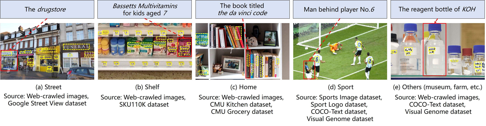

# Scene-Text Oriented Referring Expression Comprehension
This is the resource and code for the TMM paper, [Scene-Text Oriented Referring Expression Comprehension](https://ieeexplore.ieee.org/document/9939075), including the resource of the RefText dataset and official implementation of the Scene Text Awareness Network (STAN).

## Introduction

We introduce a new task called **scene-text oriented referring expression comprehension (ST-REC)**. To tackle this task, we propose a **scene text awareness network (STAN)** that can bridge the gap between texts from two modalities. Additionally, to conduct quantitative evaluations, we establish a new benchmark dataset called **RefText**, which contains 31K manually generated referring expressions for 11K objects from multiple image sources. Examples are shown as follows:

<p align="center">
  
</p>

## Data Preparation

1. Download the annotation files from [Google Drive](https://drive.google.com/drive/folders/1doQ__aVFvQDqE84AktIf7uc7WxkTOw8B?usp=share_link) and place them in  `data/reftext`
2. Download the images from [Google Drive](https://drive.google.com/drive/folders/1doQ__aVFvQDqE84AktIf7uc7WxkTOw8B?usp=share_link) and place them in  `ln_data/other/images/reftext`
3. Download the Google OCR results from [Google Drive](https://drive.google.com/drive/folders/1doQ__aVFvQDqE84AktIf7uc7WxkTOw8B?usp=share_link) and place them in `ln_data/ocr`

The folder structure for the dataset is shown below.

```
STAN
├── data
│   └── reftext
│       ├── reftext_subtest_home.pth
│       ├── reftext_subtest_oov.pth
│       ├── reftext_subtest_other.pth
│       ├── reftext_subtest_semantic.pth
│       ├── reftext_subtest_shelf.pth
│       ├── reftext_subtest_sport.pth
│       ├── reftext_subtest_street.pth
│       ├── reftext_test.pth
│       ├── reftext_train.pth
│       └── reftext_val.pth
└── ln_data
    ├── ocr
    │   └── google_ocr_results_reftext_rank_aggr.json
    └── other
        └── images
            └── reftext (contains 4,594 images)
```

## Installation

1. Clone the repository.

```
git clone https://github.com/Buki2/STAN.git
```

2. Create a virtual environment and install other dependencies.

```
conda create -n stan python=3.6
conda activate stan

conda install pytorch==1.2.0 torchvision==0.4.0 cudatoolkit=10.0 -c pytorch
pip install opencv-python-headless
pip install matplotlib
conda install -c conda-forge scipy
pip install argparse
conda install -c conda-forge pillow
pip install pytorch-pretrained-bert --ignore-installed
pip install strsimpy
pip install nltk
```

3. Download the pretrained model of Yolov3 and place it in `./saved_models`.

```
wget -P saved_models https://pjreddie.com/media/files/yolov3.weights
```

## Training

Run the code under the main folder. 

```
python train.py --gpu $GPU_ID --batch_size 14
```

We train the model on 1 GPU with a batch size of 14 for 100 epochs. Please check other experimental setups in our paper.

## Evaluation

Run the code under the main folder. Use flag `--test` to access test mode, and flag `--test_set` to choose a test set (option: test, subtest_street, subtest_shelf, subtest_home, subtest_sport, subtest_other, subtest_semantic).

```
python train.py --gpu $GPU_ID --batch_size 1 --resume ./saved_models/STAN_reftext_batch14_model_best.pth.tar --test --test_set subtest_street
```

(During the evaluation of subtest_semantic, please set the `THRES_PHI = 0.40` in the `grounding_model.py`)

## Citation

If you find this resource helpful, please cite our paper and share our work.

```bibtex
@article{tmm/Bu2022/scenetext,
  author={Yuqi Bu and Liuwu Li and Jiayuan Xie and Qiong Liu and Yi Cai and Qingbao Huang and Qing Li},
  title={Scene-Text Oriented Referring Expression Comprehension},
  journal={{IEEE} Transactions on Multimedia},
  year={2022},
}
```

## Acknowledgement

First, we thank the authors of [ReSC](https://github.com/zyang-ur/ReSC) and [BBA](https://dl.acm.org/doi/10.1145/3474085.3475629) for sharing their codes.

Second, we thank all the annotators who contribute to the RefText dataset. Special thanks to Xin Wu, Jingwei Zhang, Wenhao Fang, Junpeng Chen, Junyue Song, Yaoming Deng, Jintao Tan, Zetao Lian, Shubin Huang, Cantao Wu, Hongfei Liu, Peizhi Zhao, et al.


